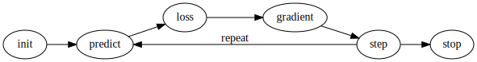
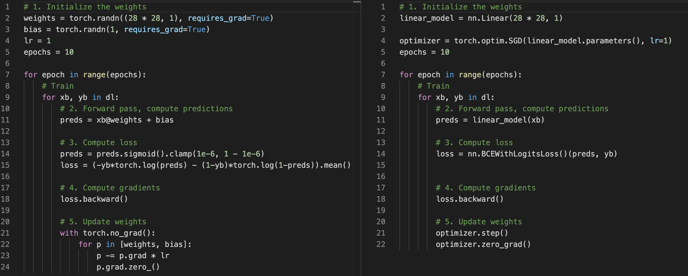

This chapter dives into implementing a binary classifier using `PyTorch`. It starts with a from-scratch implementation then simplifying it with useful classes from PyTorch and `fastai`. The task is to build a binary digit classifier to distinguish 3 and 7 using MNIST dataset. In this blog post, I will highlight the parts that excite me, whereas my full implementation can be found in this [notebook](). 

## Formulating the machine learning problem
I think this step is essential especially while facing a problem in new domains. How do you transform a problem in your domain to a machine learning problem? How do you approach it?

- This is a binary classification problem.
- Each position in an image can contribute to the classification decision. For instance, pixels at the bottom right corner could indicate that it's less likely that the image is a 7. Thus, one approach is to *consider each position as a parameter or a weight*.
- The intensity of each pixel would also contribute.
- We can derive a value based on these two components and use it to decide the classification result. 
- The classification task now turns into an optimization problem, where we would want to find the weights so that the computed values can be used to classify the digits as accurate as possible.

## The training process


From the figure in the book, the process consists of an initialization and an iterative loop:
> 1. **Init.** Initialize the weights.
>
>REPEAT
>
>2. **Predict.** For each image, use the current weights and the pixel values to compute a derived value that can be used to predict whether it appears to be a 3 or a 7.
>3. **Loss.** Measure the goodness of the model based on these predictions and real labels. Loss is the opposite measurement to the goodness as we want to minimize the loss.
>4. **Gradient.** Calculate the derivative of the loss with respect to the weights. This measures for each weight, how changing that weight would change the loss.
>5. **Step**. Change all the weights with an amount proportional to the gradients.
>
>UNTIL stopping criteria meet (such as when the model doesn't improve or get worse or already train for long enough).

## Implementation from scratch with PyTorch basics
### Weight initialization
First, what are the **weights**? Naturally, each pixel in the image can contribute to the classification decision. For instance, pixels at the bottom right corner could indicate that it's less likely that the image is a 7. Thus, one approach is to *consider each position as a parameter or a weight*. So, we have `28 * 28 = 784` weights. We are building a linear model, so besides the weights, we also need a **bias** term.

To initialize the weights and bias, we can take the simplest approach, assign the values randomly or drawing them from a normal distribution.

```
weights = torch.randn((28 * 28, 1), requires_grad=True)
bias = torch.randn(1, requires_grad=True)
```

### The iteration
We usually train a model with multiple passes or epochs using gradient descent optimization algorithm. An **epoch** is a visit through the entire dataset. The *predict-loss-gradient-step* loop operates on a number of data points, called a **mini-batch**. If the size of the mini batch is 1, we have *stochastic* gradient descent, which could make the weights jumping a lot. If the size of mini batch is the same as the size of the entire dataset, we have *batch* gradient descent, which could be slow. In practice, the size is in between these two extreme cases and depends on the memory size.

```
for epoch in range(epochs):
    for xb, yb in dl: # dl is a DataLoader instance in PyTorch for batching
        # Step 2-5 are here
```

### Prediction
With a linear model, the prediction is a linear combination of weights and data.

```
preds = xb@weights + bias
```

### Loss
A log loss can be used here which penalizes confidently wrong predictions.
```
preds = preds.sigmoid().clamp(1e-6, 1 - 1e-6) # Avoid log(0)
loss = (-yb*torch.log(preds) - (1-yb)*torch.log(1-preds)).mean()
```

### Gradient
This is the only place where we actually need PyTorch for this from scratch implementation. 
```
loss.backward()
```
After calling `backward()` the weights and bias will have the computed gradients stored in `.grad` attribute.

### Weight update
Updating the weights and bias with an amount proportional to the gradients (controlled by the learning rate `lr`).
```
with torch.no_grad(): # We don't want PyTorch calculates gradients for this weight update operation
    for p in [weights, bias]:
        p -= p.grad * lr
        p.grad.zero_() # Tell PyTorch not accumulate gradients
```

### Simplifying with PyTorch classes
PyTorch helps us simplify the code.
1. Use `nn.Linear` which does both weights initialization (Step 1) and linear transformation (Step 2).
1. Use `nn.BCEWithLoss` as a loss function (Step 3)
1. Use an optimizer `torch.optim.SGD` which handles step and zero grad (Step 4 and 5).

This side-by-side comparison could help see the changes.


For this simple linear model, the benefit might not be so great. But PyTorch provides ways to build more complex deep network architecture and a large number of loss functions and optimization algorithms. For example, here is a 4-layer deep neural net I built to achieve above 99% accuracy.
```
deep_net = nn.Sequential(
    nn.Linear(28*28, 256),
    nn.ReLU(),
    nn.Linear(256, 128),
    nn.ReLU(),
    nn.Linear(128, 64),
    nn.ReLU(),
    nn.Linear(64, 32),
    nn.ReLU(),
    nn.Linear(32, 1)
)
```

### Wrapping up with fastai classes
`fastai` makes the training process more convenient for us by encapsulating the training process in the `Learner` class. I will also output a nice table of useful information. Besides a standard model architecture, a loss function and an optimizer, it requires two extra pieces for validation:
- a `DataLoaders` instance which simply combines train and validation standard data loaders 
- a list of metrics to compute for the validation set at the end of each epoch.

```
dls = DataLoaders(dl, valid_dl)
learn = Learner(dls, deep_net, loss_func=nn.BCEWithLogitsLoss(), opt_func=SGD, metrics=batch_accuracy)
learn.fit(20, lr=0.1)
```